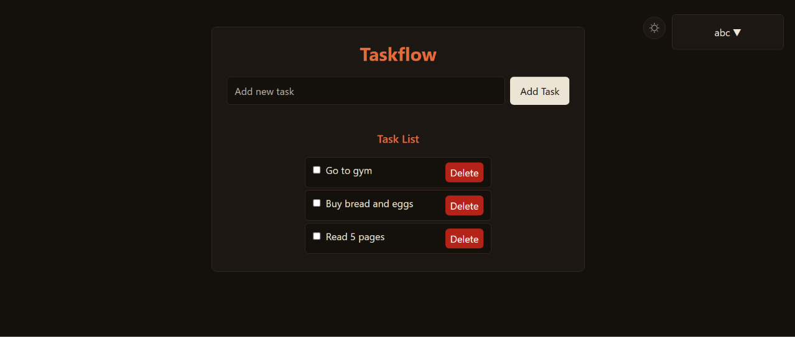
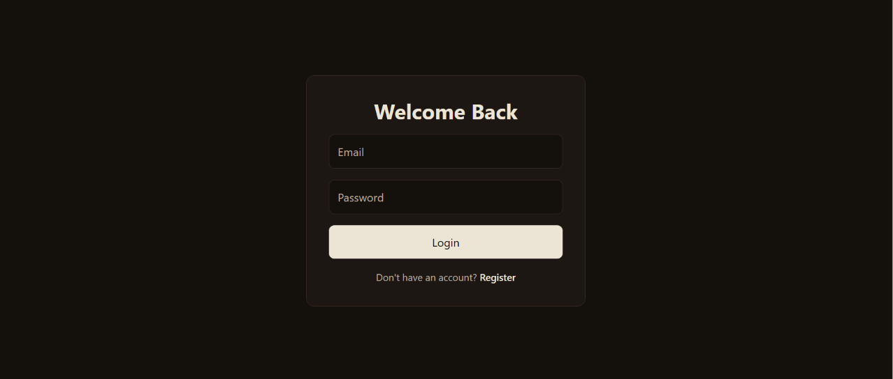
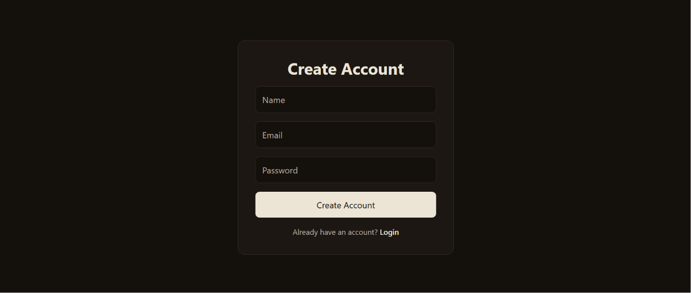

# Taskflow

A full-stack task management application built with React, Node.js, Express, and MongoDB.

## Features

- User authentication
- Create tasks
- Mark tasks as completed
- Delete tasks
- Light and dark theme
- Responsive design
- REST API
- MongoDB persistence

## Tech Stack

- React
- React Router
- Tailwind CSS
- Motion
- Node.js
- Express.js
- MongoDB
- Mongoose
- JWT

## Screenshot

## Screenshots

## Live Demo

[View Taskflow Live](https://taskflow-production-45e7.up.railway.app/login)

## What I Learned

- Building a full-stack React application
- Creating and consuming REST APIs
- MongoDB and Mongoose
- JWT authentication
- React state management
- Light and dark theme implementation
- Responsive design with Tailwind CSS
- Deploying a full-stack application
